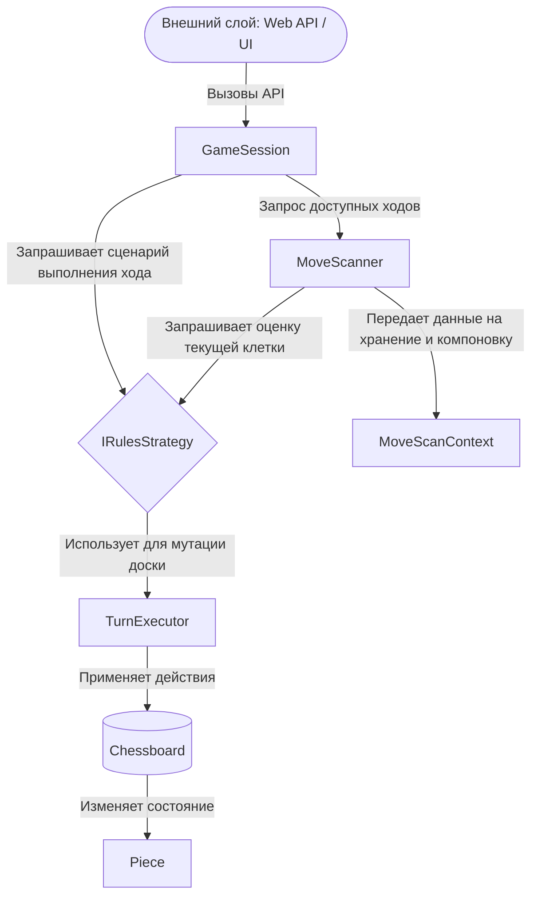

# 🏗 Архитектура системы Checkers

В данном документе описано внутреннее устройство игрового движка, распределение обязанностей между ключевыми компонентами и логическая модель данных.

---

## 🏢 Обзор архитектурных слоев

Движок спроектирован по принципу слабой связанности компонентов. Центральным оркестратором (фасадом), с которым взаимодействуют внешние слои, является класс `GameSession`. Внутренняя логика разделена на изолированные зоны ответственности:

---

## 📐 Геометрия поля и модель координат

Игровое поле инкапсулировано в классе `Chessboard`. Движок использует матричную систему координат `Point(Row, Col)`.

### Математическая модель фильтрации клеток
Для поддержки досок разной размерности (8x8, 10x10) и исключения неигровых (белых) клеток на уровне физики доски, используется фильтр четности игровой диагонали `_party`:

`(Row + Col) % 2 == party`

*   Если `useEvenSquares = true`, то `_party = 0` (игровыми являются клетки с четной суммой координат, например `(0,0)`, `(1,1)`).
*   Если `useEvenSquares = false`, то `_party = 1`.

Попытка установить или переместить фигуру на клетку, не прошедшую этот фильтр, вызывает `ArgumentException`, защищая ядро от некорректных состояний.

---

## 🔄 Транзакционная модель хода

В движке разделены понятия **физического шага** (атомарного сдвига фигуры) и **логического хода** игрока.

*   **`Move` (Перемещение):** Техническая структура, содержащая три точки: `From` (откуда), `To` (куда) и `Target` (координата сбитой фигуры, если это прыжок).
*   **`Turn` (Ход):** Контейнер лога истории. Он содержит сторону игрока (`Side`), флаг завершения (`IsCompleted`) и список `Steps`, состоящий из последовательных структур `Move`.

Многоходовая серия прыжков (серия взятий) выполняется в рамках **одного и того же** объекта `Turn`. Право хода не перейдет к оппоненту, пока правила не зафиксируют невозможность или запрет на продолжение серии.

---

## ⛓ Конвейер состояний и отложенные эффекты

Для реализации сложных шашечных правил (таких как «Турецкий удар» и специфика мгновенного/отложенного превращения в дамку) используется система временных флагов внутри класса `Piece`.

### Конвейер обработки флагов за ход:
1.  **Фаза шага (`ProcessStep`):** Если фигура перепрыгнула врага, клетка врага передается в `ApplyCaptureMark`. Фигура на этой клетке **не удаляется**, а получает флаг `IsCaptured = true`. Это исключает её из повторного взятия в текущем ходу (защита от циклов).
2.  **Фаза промежуточной валидации:** Если шашка наступила на дамочное поле, метод `CanPromote` проверяет правила. Если правила требуют завершения хода для превращения (Международные), фигура получает флаг `IsPromoted = true`, но остается простой шашкой на время серии прыжков.
3.  **Фаза финализации (`OnFinalize`):** Когда ход завершен, вызывается `SettleTurn()`. Движок запускает конвейер:
    *   Удаляет с поля все фигуры, у которых `IsCaptured == true`.
    *   Превращает в `PieceType.King` все фигуры, у которых `IsPromoted == true`.
    *   Сбрасывает все временные флаги у уцелевших фигур для подготовки к следующему ходу.

> [!NOTE]
> Сброс устаревшего кэша валидных ходов `_cachedMoves` производится централизованно в методе `PrepareNextTurn()` при успешном переходе права хода, либо при вызове `Undo()`.
