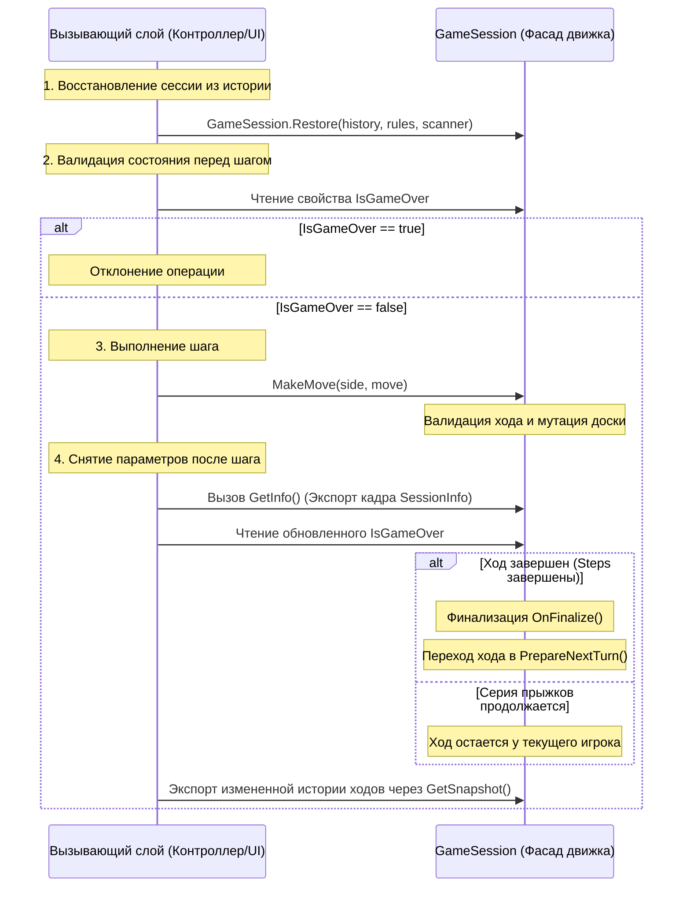

# 📖 Руководство пользователя Checkers.Engine

Данный документ является практическим руководством по работе с публичным интерфейсом движка, управлению игровым циклом и реализации пользовательских правил.

---

## 🏢 Интерфейс взаимодействия (Фасад GameSession)

Класс **`GameSession`** спроектирован как единая точка входа (Фасад) движка. Он полностью инкапсулирует внутренний механизм игры и предоставляет вызывающему коду простой интерфейс для управления.

### Основные возможности фасада:
*   **`MakeMove(side, move)`** — совершает один шаг текущего игрока, проверяет его валидность и управляет завершением хода.
*   **`Undo()`** — пошагово откатывает совершенные действия в рамках текущего незавершенного хода.
*   **`GetValidMoves(side)`** — возвращает список доступных ходов.
*   **`GetInfo()`** — отдает актуальный срез данных (кадр игры) для отрисовки интерфейса.
*   **`GetSnapshot()` / `GameSession.Restore(...)`** — механизм «снимка» и мгновенного восстановления сессии из чистой истории ходов (`List<Turn>`).

Поскольку движок полностью восстанавливает свое состояние из истории, вызывающий контроллер может использовать фасад как **систему с транзакционным восстановлением состояния (Stateless-подход)**, не удерживая объект игры в памяти постоянно между действиями пользователей.




### 📝 Практический пример: Реализация сквозного сценария транзакции

Ниже представлен готовый класс, демонстрирующий полный цикл взаимодействия внешнего слоя с фасадом `GameSession` в **Stateless-парадигме** [INDEX]. Код наглядно иллюстрирует фазы инициализации, предварительной проверки, обработки шага (включая многоходовую серию) и финального экспорта данных для сохранения [INDEX].

```csharp
using Сheckers.Engine;
using Сheckers.Engine.Scanning;
using Сheckers.Engine.Rules.Variants;

public class GameTransactionWorkflow
{
    public void ExecutePlayerAction(Move playerMove)
    {
        // === 1. ПОДГОТОВКА СИСТЕМЫ И ВОССТАНОВЛЕНИЕ СОСТОЯНИЯ ===
        var rules = new RussianRules();
        var scanner = new MoveScanner();

        // Восстанавливаем сессию из истории (например, загруженной из БД или кэша)
        // В реальном сценарии 'savedHistory' передается из репозитория данных
        List<Turn> savedHistory = []; // Имитация: для новой игры список пуст
        
        GameSession session = savedHistory.Count > 0 
            ? GameSession.Restore(savedHistory, rules, scanner)
            : new GameSession(rules, scanner);

        // === 2. КОНТРОЛЬ СОСТОЯНИЯ ПЕРЕД НАЧАЛОМ ОПЕРАЦИИ ===
        // Принцип непрерывного контроля: блокируем любые мутации мертвой сессии
        if (session.IsGameOver)
        {
            Console.WriteLine("Операция отклонена: данная партия уже завершена.");
            return;
        }

        PieceSide currentSide = session.ActiveSide;
        Console.WriteLine($"Текущий активный игрок: {currentSide}");

        // === 3. ПОЛУЧЕНИЕ И ВАЛИДАЦИЯ ДОСТУПНЫХ ПЕРЕМЕЩЕНИЙ ===
        // Движок возвращает List<Move> из оптимизированного внутреннего кэша
        List<Move> validMoves = session.GetValidMoves(currentSide);

        if (!validMoves.Contains(playerMove))
        {
            Console.WriteLine("Ошибка: Запрошенное перемещение не входит в список допустимых.");
            return;
        }

        // === 4. ТРАНЗАКЦИОННОЕ ВЫПОЛНЕНИЕ ДЕЙСТВИЯ ===
        try
        {
            // Метод MakeMove сам проверит, является ли шаг тихим или это прыжок-взятие
            session.MakeMove(currentSide, playerMove);
        }
        catch (InvalidOperationException ex)
        {
            Console.WriteLine($"Критический сбой бизнес-логики движка: {ex.Message}");
            return;
        }

        // === 5. НЕПРЕРЫВНЫЙ КОНТРОЛЬ ПАРАМЕТРОВ ПОСЛЕ МУТАЦИИ ===
        // Запрашиваем актуальный срез данных (кадр игры) через кастомную структуру SessionInfo
        SessionInfo info = session.GetInfo();

        if (session.IsGameOver)
        {
            // Сценарий А: Действие привело к мату, съедению всех фигур или патовой блокировке
            Console.WriteLine($"Партия успешно остановлена! Результат: {info.Status}, Причина: {info.EndReason}");
        }
        else if (info.ActiveSide != currentSide)
        {
            // Сценарий Б: Ход полностью завершен (серия прыжков окончена или был совершен тихий ход)
            // Движок внутри MakeMove автоматически вызвал OnFinalize() и PrepareNextTurn()
            Console.WriteLine($"Ход игрока {currentSide} успешно финализирован. Право действия перешло к: {info.ActiveSide}");
        }
        else
        {
            // Сценарий В: Был совершен промежуточный прыжок в серии, и правила требуют продолжить взятие
            // Право хода остается у того же игрока, история ходов удерживает текущий открытый Turn
            Console.WriteLine($"Игрок {currentSide} обязан продолжить серию прыжков текущей фигурой.");
            
            // ПРИМЕЧАНИЕ: Если игрок ошибся в цепочке прыжков, внешний слой может вызвать откат:
            // session.Undo();
        }

        // === 6. ЭКСПОРТ ОБНОВЛЕННОЙ ИСТОРИИ ДЛЯ СОХРАНЕНИЯ ===
        // Извлекаем иммутабельный слепок хронологии через рекорд GameSnapshot
        GameSnapshot snapshot = session.GetSnapshot();
        
        // Объект snapshot.History (List<Turn>) полностью готов к сериализации и сохранению
        // SaveHistoryToDatabase(snapshot.History);
        Console.WriteLine($"Транзакция успешно завершена. Всего ходов в истории: {snapshot.History.Count}");
    }
}
```

---

## 📊 Справочник игровых статусов и завершения партии

Внешний интерфейсный слой обязан опрашивать эти свойства **дважды за транзакцию**: строго *до* попытки вызвать `MakeMove` (чтобы отклонить запросы к завершенной сессии) и сразу *после* вызова (чтобы зафиксировать изменения, определить, перешел ли ход, или партия была остановлена).

### 1. `GameStatus` (Глобальное состояние сессии)
Определяет глобальный статус процесса:
*   `InProgress` — Партия активна, ходы принимаются.
*   `WhiteWin` — Победа белых фигур.
*   `BlackWin` — Победа черных фигур.
*   `Draw` — Партия остановлена ничейным результатом.

### 2. `GameEndReason` (Причина остановки партии)
Детализирует причину, зафиксированную в `GameStatus`:
*   `None` — Игра продолжается.
*   `AllPiecesCaptured` — Физическое уничтожение: у проигравшей стороны не осталось фигур.
*   `NoAvailableMoves` — Патовая ситуация: фигуры игрока заблокированы, валидных ходов нет.
*   `MutualBlock` — **Взаимная блокировка (Взаимный пат):** Ситуация, при которой оба игрока заперли друг друга. Движок перехватывает управление и принудительно останавливает партию с результатом `Draw`.
*   `ExternalCommand` — Игра прервана внешним вызовом (сдача игрока, техническое поражение).

---

## ⚙ Разработка кастомных правил (Интерфейс IRulesStrategy)

Создание кастомных вариантов шашек строится вокруг реализации контракта `IRulesStrategy`. Контракт разделен на четыре изолированные группы методов.

### Группа 1: Геометрия и Инициализация доски
Методы этой группы определяют физические границы игры и вызываются движком при создании поля или полном воспроизведении истории ходов.

```csharp
BoardSettings GetSettings();
IEnumerable<StartPosition> GetInitialPositions();
```

*   **`GetSettings()`** — возвращает параметры доски через **`BoardSettings`**. 
    #### Тип `BoardSettings`:
     * `Rows` (количество рядов)
     * `Cols` (количество столбцов)
     * `useEvenSquares` (флаг чётности игровой диагонали). На основе этого объекта движок строит физическую матрицу доски и отсекает неигровые клетки.

*   **`GetInitialPositions()`** — формирует коллекцию координат и типов фигур для начальной расстановки сил с использованием структуры **`StartPosition`** .
    #### Тип `StartPosition`:
    * `Square` (клетка на которую поставить фигуру)
    * `Side` (белая/чёрная)
    * `Type` (тип фигуры - шашка, дамка)


---

### Группа 2: Логика сканирования
Данный блок отвечает за правила по которым будут взаимодействовать фигуры друг с другом.

```csharp
ScanVerdict EvaluateMove(Piece scanningPiece, RayDirection direction, ScanState state, int distance, bool isOccupied);
bool IsEnemy(Piece actor, Piece target);
```

Данные методы используються внутренним механизмом проверки взаимодействия фигур (Сканером). Для начала сканер берёт фигру и определяет направления по которым эта фигура может ходить (вверх-влево, вниз-вправо,...). Потом для каждого направления сканер проходит все клетки по очереди, меняя свой внетренммй статус. Таким образом он находит валидные ходы.
#### 🔗 Взаимосвязь EvaluateMove и IsEnemy:
Сканер обрабатывает каждую клетку на векторе луча в два этапа:
1. **Вызов `EvaluateMove`:** Стратегия правил решает, можно ли физически приземлиться на эту клетку (флаг `IsPossible` в возвращаемом типе **`ScanVerdict`**) и нужно ли сканеру продолжать движение дальше по лучу (флаг `CanContinue` в `ScanVerdict`).
2. **Анализ занятости клетки:** Если на траектории луча клетка занята фигурой, а правила вернули `CanContinue == true`, сканер выполняет проверку `IsEnemy()`. При обнаружении вражеской фигуры внутренний статус сканера переключается на `ScanState.TargetDetected` для поиска точки приземления за ней на следующем шаге.

#### 🤖 Специфика работы со статусами сканера (`ScanState`):
Метод `EvaluateMove` обязан адаптировать возвращаемый тип **`ScanVerdict`** под текущую фазу автомата, переданную в параметре `state`:
*   `ScanState.Default` — Обычный поиск ходов. Ищем тихие перемещения. Если натыкаемся на фигуру, возвращаем `ScanVerdict(IsPossible: false, CanContinue: true)`, чтобы сканер мог опознать в ней потенциальную цель на втором этапе.
*   `ScanState.ForcedCaptureOnly` — В рамках текущей сессии на доске обнаружен обязательный бой. Правила должны пропускать пустые клетки, возвращая `ScanVerdict(IsPossible: false, CanContinue: true)`, пока не упрутся в цель.
*   `ScanState.TargetDetected` — На предыдущем шаге луча обнаружен враг. Теперь `IsPossible` в `ScanVerdict` должен стать `true` **только если текущая клетка абсолютно пуста** (подтверждение завершения прыжка).
*   `ScanState.CaptureMoveFound` — Прыжок через врага уже подтвержден на предыдущих шагах луча. Для простых шашек правила обычно возвращают `CanContinue = false`, а для дальнобойных дамок — `CanContinue = true`, позволяя выбирать любую клетку приземления дальше по траектории луча.

---

### Группа 3: Управление шагом и Финализация хода
Методы этой группы связывают судейские решения с физическими изменениями на доске, управляя ходом через контекст `ITurnActions`.

```csharp
bool ProcessStep(ITurnActions actions, Move move);
void OnFinalize(ITurnActions actions, Point finalSquare);
```

#### 🔄 Обработки хода и конвейер изменения ранга:
Движок поддерживает гибкую обработку изменения статуса фигур (превращения простых шашек в дамки, отметка что фигура была взята). Модификация может происходить по двум сценариям в зависимости от выбранных правил:
1. **Мгновенное изменение ранга:** Вызывается непосредственно в процессе выполнения шага (`ProcessStep`) методом `actions.ApplyPromotion`, если правила (например, Русские шашки) разрешают шашке стать дамкой прямо в процессе серии прыжков и продолжить бой уже в новом статусе.
2. **Отложенное изменение ранга (Флаговая модель):** Вызывается методом `actions.ApplyPromotionMark`. Фигура на доске визуально остается простой шашкой, чтобы предотвратить появление дальнобойных свойств в середине серии (например, в Международных шашках). Реальное физическое превращение и зачистка доски произойдут только на этапе финализации хода (`OnFinalize`) при вызове `actions.ApplyFinalEffects`.

#### 🛠 Анатомия интерфейса ITurnActions (Контекст мутаций):
Движок полностью изолирует прямые модификации доски, предоставляя правилам доступ к методам интерфейса `ITurnActions`:
*   `void ApplyMove(Move move)` — выполняет физический сдвиг фигуры `From` → `To`.
*   `void ApplyCaptureMark(Point target)` — помечает фигуру в точке `target` как взятую (`IsCaptured = true`). Фигура физически не исчезает до конца хода, блокируя повторный прыжок через неё.
*   `void ApplyPromotion(Point pieceLocation)` — мгновенно изменяет ранг фигуры (повышает до дамки).
*   `void ApplyPromotionMark(Point target)` — помечает фигуру как готовую к повышению в конце хода.
*   `void ApplyRemoval()` — окончательно удаляет с доски все помеченные битые фигуры.
*   `void ApplyRemoval(Point target)` — точечно удаляет конкретную фигуру с доски.
*   `void ApplyFinalEffects()` — применяет все отложенные эффекты за ход (материализация отложенных дамок и вызов `ApplyRemoval()`).
*   `bool CanPromote(Point square)` — проверяет, находится ли указанная клетка на дамочной линии для фигуры стоящей на ней.

---

### Группа 4: Судейство (Определение финала)
Методы этой группы не имеют доступа к интерфейсу мутаций `ITurnActions`, работают в режиме Read-Only и вызываются сессией для фиксации блокировок.

```csharp
TurnResult HandleNoMoves(PieceSide side, Chessboard board);
GameResult JudgeTerminalState(PieceSide side, Chessboard board);
```

*   **`HandleNoMoves`** — решает, что делать при полном отсутствии ходов у стороны. Возвращает тип **`TurnResult`** (`SwitchSide` — пропуск хода, `GameFinished` — остановка партии).
*   **`JudgeTerminalState`** — вызывается после остановки игры. Анализирует финальную расстановку сил на доске и возвращает структуру **`GameResult`** `(GameStatus Status, GameEndReason Reason)`, фиксируя победителя и точную техническую причину завершения.

---

### 📝 Общий пример реализации кастомной стратегии

```csharp
public class MyCustomRules : IRulesStrategy
{
    // === ГРУППА 1: ГЕОМЕТРИЯ И ИНИЦИАЛИЗАЦИЯ ===
    public BoardSettings GetSettings() => new(8, 8, useEvenSquares: true);
    
    public IEnumerable<StartPosition> GetInitialPositions()
    {
        yield return new StartPosition(new Point(7, 0), PieceSide.White, PieceType.Man);
    }

    // === ГРУППА 2: СКАНИРОВАНИЕ ===
    public ScanVerdict EvaluateMove(Piece scanningPiece, RayDirection direction, ScanState state, int distance, bool isOccupied)
    {
        if (state == ScanState.ForcedCaptureOnly)
        {
            return new ScanVerdict(IsPossible: false, CanContinue: true); // Пропускаем пустые клетки при поиске боя
        }
        
        if (state == ScanState.TargetDetected)
        {
            return new ScanVerdict(IsPossible: !isOccupied, CanContinue: false); // Приземление за врагом
        }

        return new ScanVerdict(IsPossible: !isOccupied, CanContinue: isOccupied);
    }

    // === ГРУППА 3: УПРАВЛЕНИЕ ШАГОМ И ФИНАЛИЗАЦИЯ ===
    public bool ProcessStep(ITurnExecution actions, Move move)
    {
        actions.ApplyMove(move);
        if (move.Target.HasValue)
        {
            actions.ApplyCaptureMark(move.Target.Value);
            return true; // Был бой, сообщаем о потенциальном продолжении серии
        }
        return false;
    }

    public void OnFinalize(ITurnExecution actions, Point finalSquare)
    {
        if (actions.CanPromote(finalSquare))
        {
            actions.ApplyFinalEffects(); // Сначала зачищаем, затем коронуем или наоборот согласно правилам
        }
        actions.ApplyFinalEffects();
    }

    // === ГРУППА 4: СУДЕЙСТВО (ФИНАЛ) ===
    public TurnResult HandleNoMoves(PieceSide side, IBoardInspection board) => TurnResult.GameFinished;

    public GameResult JudgeTerminalState(PieceSide side, IBoardInspection board)
    {
        var winner = side == PieceSide.White ? GameStatus.BlackWin : GameStatus.WhiteWin;
        return new GameResult(winner, GameEndReason.NoAvailableMoves);
    }
}
```